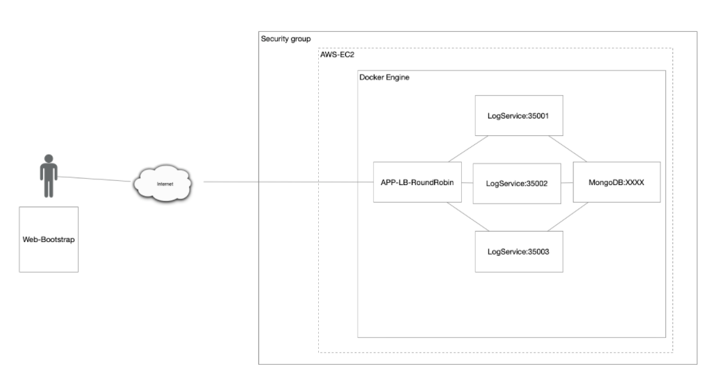
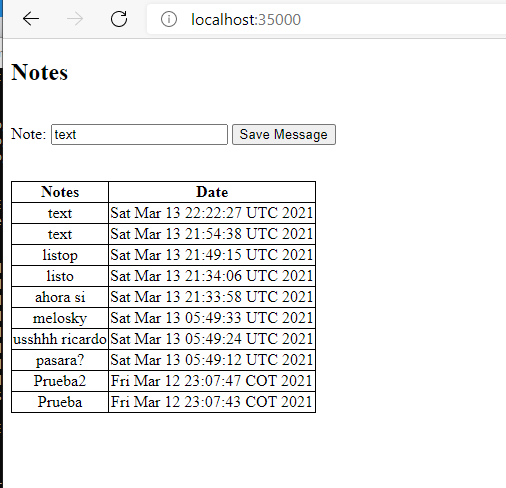
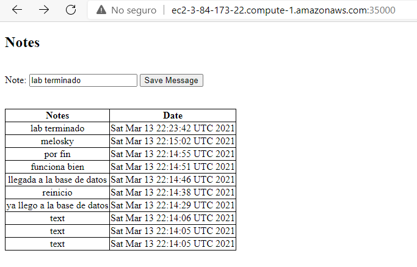

# TALLER DE DE MODULARIZACIÓN CON VIRTUALIZACIÓN E INTRODUCCIÓN A DOCKER Y A AWS

## _Despliegue en AWS_

[AWS](http://ec2-3-84-173-22.compute-1.amazonaws.com:35000/)

## Pr-requisitos:
  1. Java 8
  2. Mvn
  3. Docker
  4. Docker-compose
  5. Una cuenta en AWS si desea desplegar el proyecto en una maquina virtual de ahí.

## Introducción

Este laboratorio esta hecho usando el micro-framenwork Spark un cliente web y un par de servicios REST, la idea es aprender a usar los contenedores de Docker para consumir recursos como una bases de datos, en este caso MongoDB, debemos crear un balanceador de carga que consumirá la imagen de nuestro proyecto para poder desplegar 3 nodos diferentes que consuman los datos enviamos desde la pagina web y la guarden en la base de datos, luego nos enviara el resultado de la tabla actualizada donde se mostraran las notas tomadas las fecha en que se hicieron.

## Arquitectura

Para esta arquitectura, se creará un maquina EC2 de AWS, el cual contendrá un par de imágenes de mi Docker hub, y un Docker compose para poder desplegar el APP-LB-RoundRobin que será nuestro balanceador de carga y repartirá los datos ingresados de la aplicación a alguno de los 3 nodos llamados LogService que lo que harán es guardar esta información en la base de datos y además devolverá la lista de datos actualizada para poder mostrarla. Como pueden ver el grupo mas grande el de Security group, aquí debemos habilitar los puertos en AWS para que pueda leer el balanceador y la base de datos de mongo.



## Despliegue local

Para desplegar el proyecto localmente en cuestión de código no debe hacer ningún cambio, simplemente debe construir 2 imágenes y ejecutar el docker compose.
Para las imágenes debes generarlas siguiendo estos pasos.

  1. Debes ingresar a la carpeta de LogService dento de ella encontraras un archivo llamado Dcokerfile el cual usaremos para generar las imágenes de los nodos, deberas usar el siguiente comando.
      ```
      mvn clean install package
      docker build --tag logservice .
      ```
  2- Debes ingresar a la carpeta RoundRobin y al igual que el paso anterior encontrará un archivo Dockerfile, estos le permitirá construir las imágenes de acuerdo al código creado, si se fijan bien se darán cuenta que estas carpetas son 2 proyectos mvn y es muy importante que en ambos casos usen el comando mvn, porque esto les creara en cada carpeta un carpeta llamada terget, la cual usaremos en nuestro proyecto, por favor asegúrese que estas carpetas target se hayan creado tanto en LoadService como en RoundRobin.
  
    ```
    mvn clean install package
    docker build --tag balancer .
    ```
  
mvn clean install package
docker build --tag balancer .

Es muy importante que el nombre logservice y balancer no los cambies, y si es así, asegúrate de cambiar estos nombres también en el docker compose, ya que se escribió de tal forma que el docker-compose lea estas imágenes.
 para ello debe abrir la consola o terminal desde la carpeta raíz del proyecto, en el encontrar un archivo Docker-compose.yml, y para ejecutarlo deberá escribir el siguiente comando.


```
  docker-compose up -d
```

El -d sirve para que no veas los logs que genera el docker-compose, simplemente crea o actualiza el contenedor que genera, como debes tener Docker instalado para poder correr el proyecto localmente, si ingresas a la interfaz grafica encontraras una pestaña en la parte izquierda llamada Conteiners/Apps y se habrá generado un contenedor llamado arep-lab5, dentro deberás encontrar 5 imágenes, una representa el balanceador de carga, de la clase RoundRobin, las otras 3 representan los nodos del logService y, finalmente la imagen de la base de datos mongo.

Para ver las imágenes use el siguiente comando
```
  docker images
```
Y para ver los contenedores use el siguiente comando.
```
  docker ps
```
La lógica de la aplicación es muy sencilla, tienes un campo para ingresar una nota, y dar clic en save note, luego deberás esperar varios segundos al principio mientras inicia la aplicación, pero luego podrás ver como aparece una tabla con la última inserción y la fecha en la que se hizo. Vera lo siguiente.



## Despliegue en maquina EC2 de AWS.

Para realizar este despliegue debe asegurarse de instalar en ella docker y docker-compose para lo cual deberá copiar los siguientes comandos que crearan las imágenes de mi repositorio de docker hub.
```
docker run -d -p 35000:6000 --name balancer juanmol/balancer
docker run -d -p 35001:6000 --name logserviceone juanmol/logservice
```
Además debe crear un archivo llamado docker-compose.yml, en el deberá copiar el que ya tenemos en este repositorio y solo deberá cambiar un par de líneas, y deberá quedar así.

```
version: '2'

services:

  balancer:
    image: juanmol/balancer
    container_name: balancer
    networks:
      arep-lab5_default:
        ipv4_address: 172.24.0.2
    ports:
      - "35000:6000"

  log1:
    image: juanmol/logservice
    networks:
      arep-lab5_default:
        ipv4_address: 172.24.0.3

  log2:
    image: juanmol/logservice
    networks:
      arep-lab5_default:
        ipv4_address: 172.24.0.4

  log3:
    image: juanmol/logservice
    networks:
      arep-lab5_default:
        ipv4_address: 172.24.0.5

  db:
    image: mongo:3.6.1
    container_name: db
    volumes:
      - mongodb:/data/db
      - mongodb_config:/data/configdb
    networks:
      arep-lab5_default:
        ipv4_address: 172.24.0.6
    ports:
      - 27017:27017
    command: mongod

networks:
  arep-lab5_default:
    ipam:
      driver: default
      config:
        - subnet: 172.24.0.0/16

volumes:
  mongodb:
  mongodb_config:
```

Guarde ese archivo y ejecute el siguiente comando para usarlo docker-compose up -d y si debe buscar cuál es su url y colocar el puerto 35000 y vera algo como ver lo [siguiente](http://ec2-3-84-173-22.compute-1.amazonaws.com:35000/). Si por alguna razón la página ya no está desplegada deber ser como esta en la imagen.




## Autores ✒️

_Menciona a todos aquellos que ayudaron a levantar el proyecto desde sus inicios_

* **Sebastian Nieto** - [sebastianNieto](https://github.com/sebastianNietoMolina)

## Licencia 📄

Este proyecto está bajo la Licencia MIT - mira el archivo [LICENSE.md](LICENSE.md) para detalles


